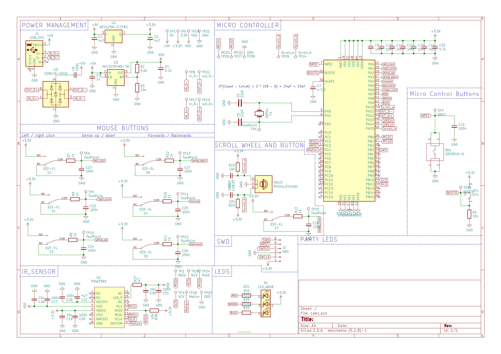
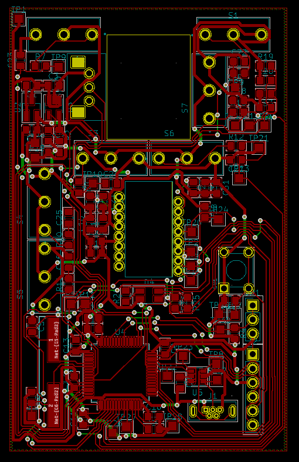
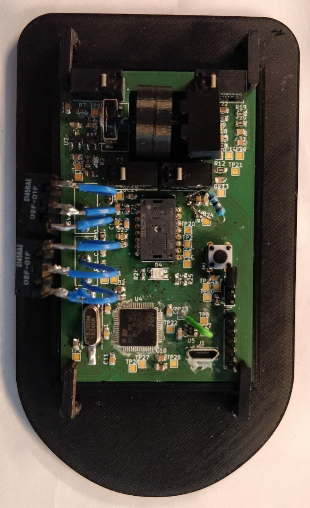
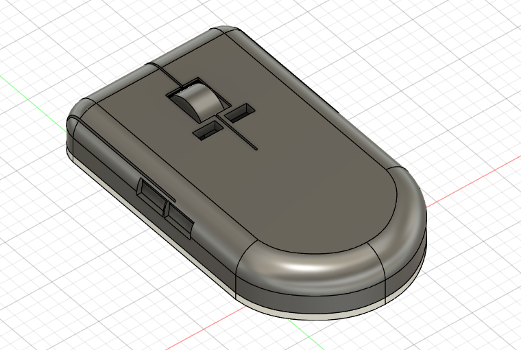
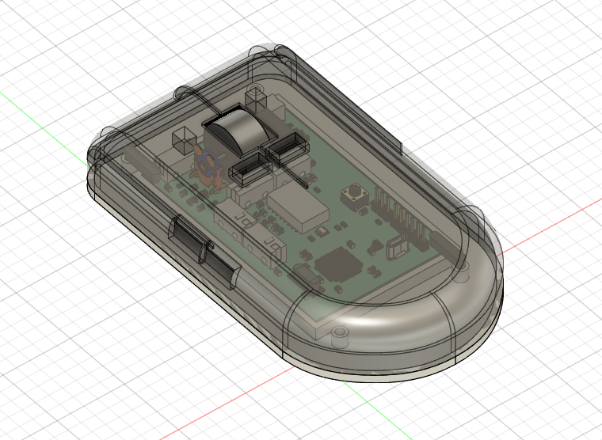
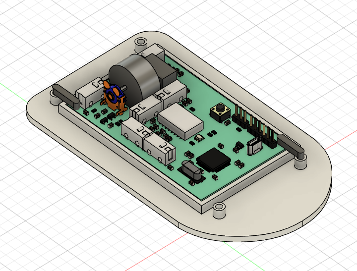
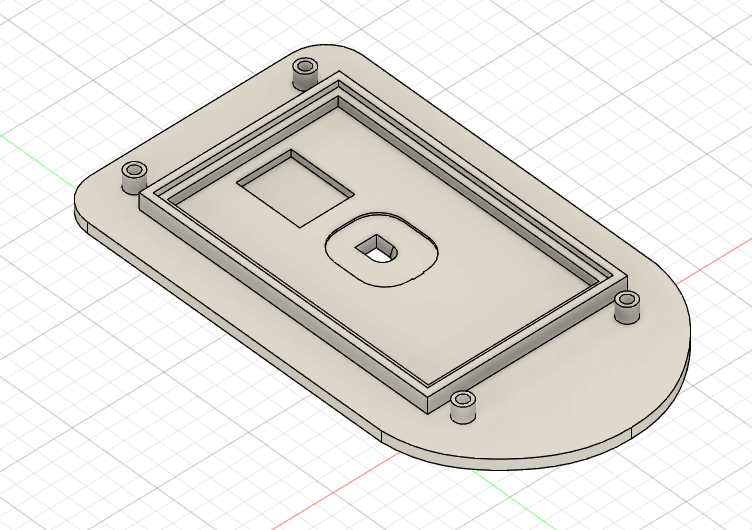
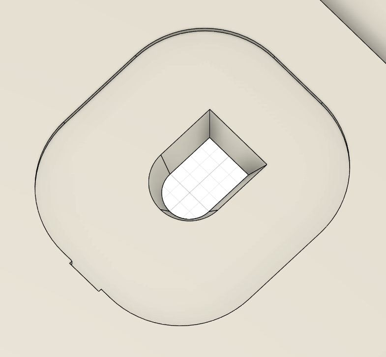

## MOUSE - Minimal Output User Signal Encoder

# _**Intended features**_
-----------
- Button functionality built into the scroll wheel - One should be able to click the scroll wheel.
- additional buttons found on the mouse: 
1. Mouse sensitivity buttons - one to increase sensitivity and one to reduce it.
2. forward/back buttons - two macro buttons for the user to bind.

- Led user settings.
- Custom shell. 3D printed.

# _**Design overview**_
-----------

_Buttons provide:_
1. Right and left click.
2. Mouse wheel click.
3. Forward and backwards, which are two macro buttons.
4. Sense up and sense down, two buttons to control mouse sensitivity.

_Sensor provide position data._

_PSU provide:_
1. 3.3V to the buttons and mcu.
2. 1.9V to the sensor.

# _**Circuit design**_
-----------
_**KiCAD diagram**_
-----------

# _**Board design**_
_**KiCAD model**_
-----------

_**3D model**_
-----------

_**Real board**_
-----------
##### Version 1

##### Version 2

# _**Custom case**_
-----------
The case was designed from scratch using Fusion 360.

# _**Demo**_
-----------
##### Demo of mouse functionality

##### Demo of 3D printed case

# **_Contributors_**
-----------

Edward Källstedt - edwkll-7@student.ltu.se (Grade goal 5)

Kalle Löfgren - kallfg-3@student.ltu.se (Grade goal 5)

Carmen Acín Rouco - caracn-0@student.ltu.se (Grade goal 5)
