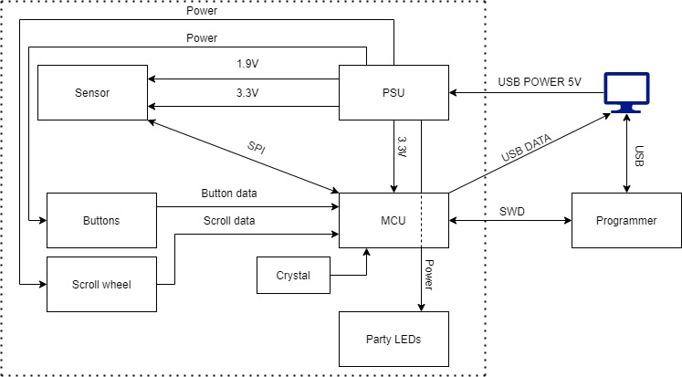

# MOUSE - Minimal Output User Signal Encoder

_Questions for Per:_
1. What are the requirements for a 5?
2. Do you have to implement wireless functionality?
3. Individual LEDs or programmable LED strip?
4. How would one go about selectively turning LEDs on? The ones we've implemented in lab 1 were "indication leds". 
5. Is the scroll wheel a component? If not, will we need to make the wheel ourselves?
6. Will a memory be necessary to implement or can the MCU store enough data? (regarding LED modes, user settings, etc)

_**Intended features**_
-----------
- USB powered: no need to reinvent the wheel for this **AMAZING** product!
- Scroll wheel "brake function" - One should be able to unlock the scroll wheel so it can spin freely and lock it with one and the same button.
- Button functionality built into the scroll wheel - One should be able to click the scroll wheel.
- additional buttons found on the mouse: 
1. Mouse sensitivity buttons - one to increase sensitivity and one to reduce it, for maximum gaming **PERFORMANCE**.
2. forward/back buttons - two blank buttons for the user to bind (macros?).
3. LED mode button - Gives the ability to change the mode through the LED button.

- Programmable macros should be implemented in software. No dedicated extra button for macros needed. Make it possible to rebind forward/back for example.
- Different profiles can be stored on the mouse. Change profile through some combination of button presses. Indicate the profiles with the LEDs.
- Custom shell. 3D printed.

**_Contributors_**
-----------

Edward Källstedt - edwkll-7@student.ltu.se

Kalle Löfgren - kallfg-3@student.ltu.se

Carmen Acín Rouco - caracn-0@student.ltu.se